

<h1>DevJobs</h1>

DevJobs en una plataforma donde reclutarores del mundo TECH pueden publicar sus vacantes de empleos y los desarrolladores de sofware pueden buscar estas vancantes y postularse para ser empleados.

Users para pruebas:
cltr996@gmail.com   (reclutador)
prueba@gmail.com    (reclutador)
correo2@correo.com  (dev)
correo3@correo.com  (dev)

password: 123123123

<h2>La aplicación Web posee las siguentes características:</h2>

<ul>
  <li>
    Panel de autenticación para el Login:
    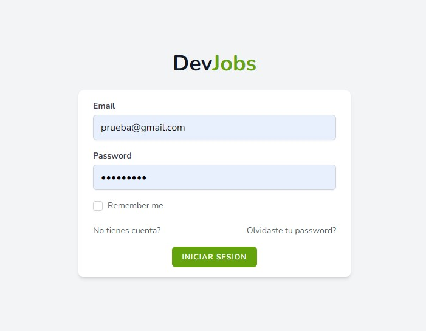
  </li>

  

  <li>
    Panel para crear cuenta:
    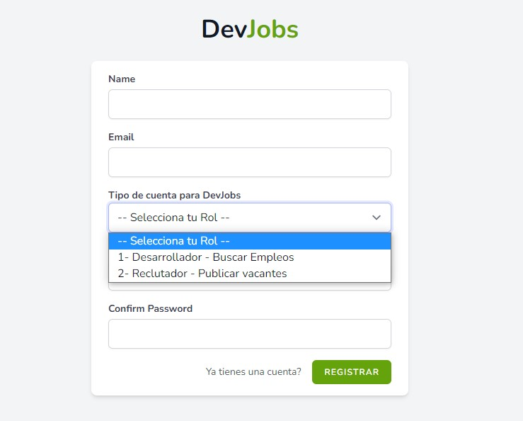
  </li>
  
  

  <li>
    Página de administración para reclutadores:
     
    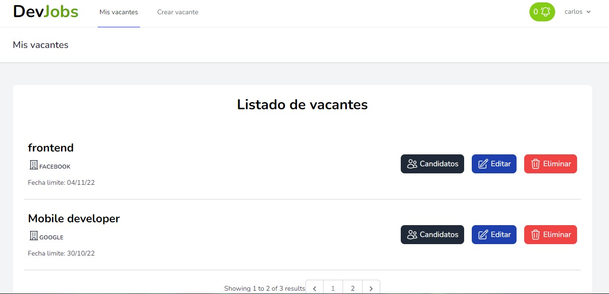
    
    Este apartado solo está disponible para persona que se hayan registrado como reclutadores
  </li>

  

  

  <li>
    Página para creación de vacantes:
    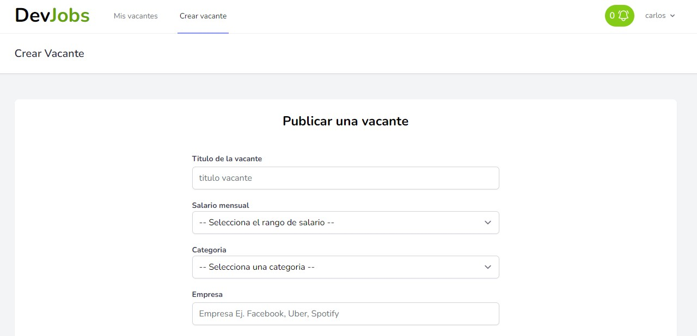
    
    Este apartado solo está disponible para persona que se hayan registrado como reclutadores
    
  </li>

  

  <li>
    Página de postulaciones:
    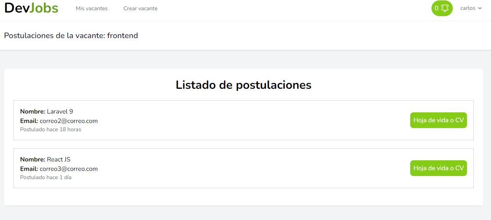
    
    En este apartado el reclutador puede ver las postulaciones a las vacantes que haya publicado y la información de los candidatos

  </li>

  

  <li>
    Página de búsqueda de vacantes:
    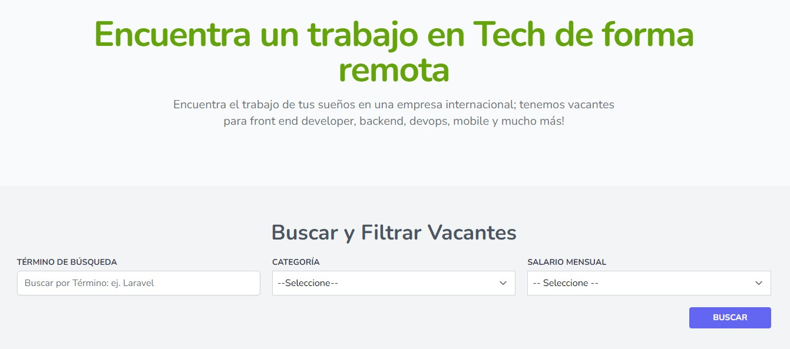
    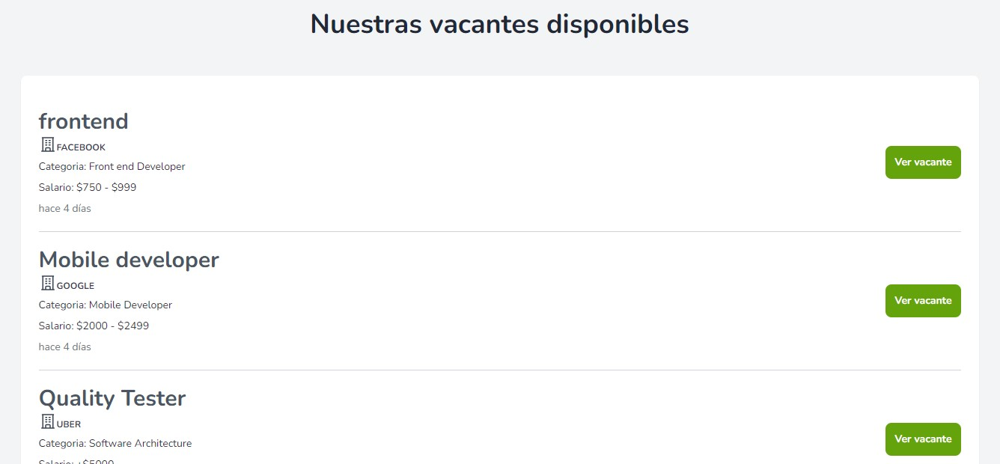

    En este apartado, las personas pueden introducir diferentes términos para realizar la búsqueda de su interés.
  </li>

  

  <li>
    Página para postularse:
    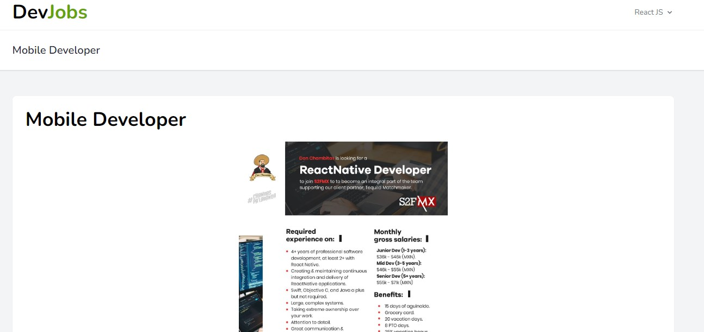
    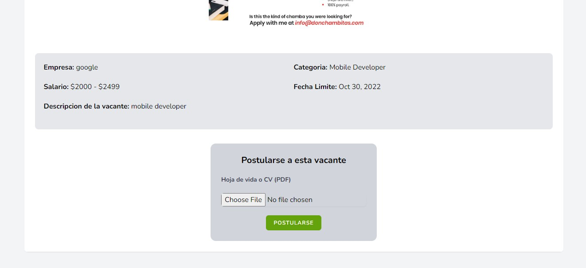
    
    Las vacantes pueden ser vistas por todo los usuarios, pero la opción de postularse sólo les aparecerá a las personas que se hayan resgistrado con el rol de Desarrollador.

    
  </li>
  
</ul>

  <li>
    Notificación de nuevas postulaciones:
    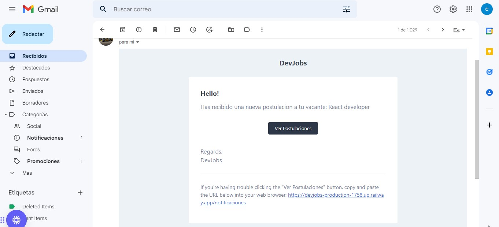
    
    Cada vez que un nuevo desarrollador se postule a una vacante, el reclutador recibe un correo de notificación con la información

    
  </li>
  
</ul>

<h2>Base de datos:</h2>

La base de datos utilizada fue SQL y se usa el ORM Eloquent de Laravel para interactuar esta

A continuación el diagrama de realacines de las tablas utilizadas para la aplicación:

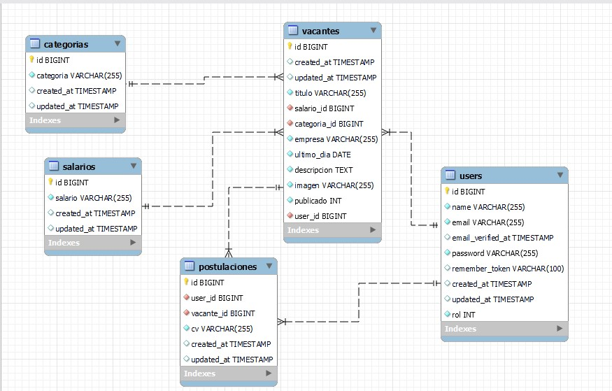

<h2>Funcionalidad</h2>
<ul>

<li>Todas las funcionalidades de formularios para login, registros y busquedas fue realizada con LiveWire.</li>

<li>Para login, registration, password reset, email verification, and password confirmation se utilizó "Breeze"  el "application starter kits" que ofrece Laravel</li>

</ul>

